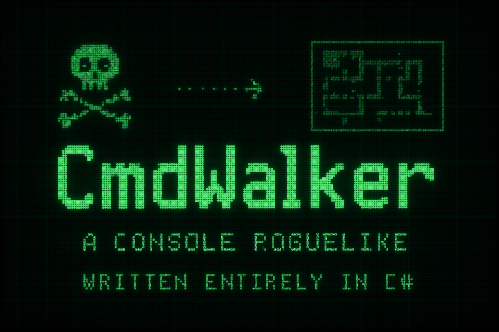
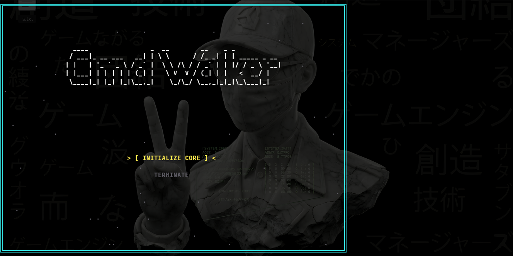
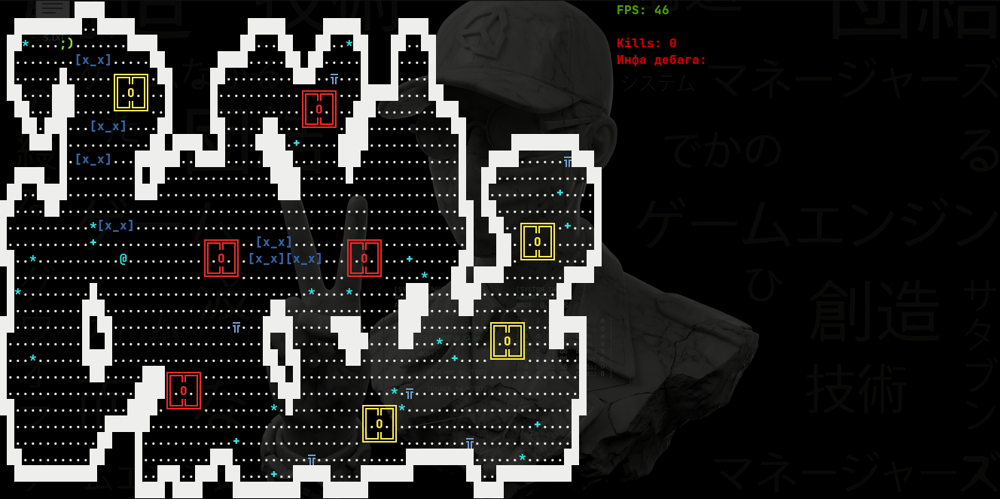
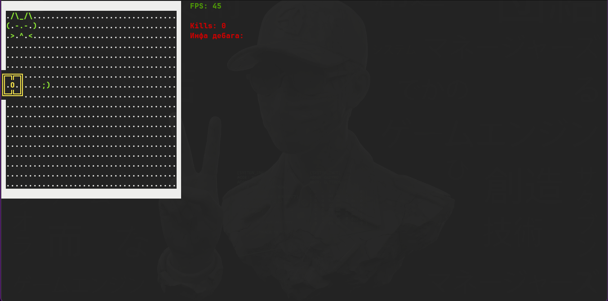

  
# 🧩 CmdWalker  

*A console roguelike experiment that accidentally evolved into a full-fledged architecture lab.*

---

## 💀 Overview  

Originally started as a “let’s just mess around with GoF patterns” kind of thing — somehow ended up with **procedural generation**, **combat**, **inventory**, and **enemies** that actually know how to chase you (most of the time).  

Built entirely in **C#**, without engines, frameworks, or any visual libraries.  
Just pure code, logic, and suffering.  

---

## ⚠️ **IMPORTANT — READ BEFORE LAUNCH** ⚙️  

> ### 🧠 Run **only** in the original Windows **CMD (cmd.exe)**  
> **Do NOT** use:
> - Windows Terminal  
> - Visual Studio’s internal console  
> - Any other “modern” emulators  
>
> These tend to break things that *definitely* weren’t supposed to work in the first place.  
> If it’s not the **classic black CMD window** — don’t trust it.

---

## 🧠 Core Features  

- Procedural map generation  
- Enemy AI and pathfinding (A* with size awareness)  
- Combat system  
- Inventory & equipment  
- Scene management  
- Custom rendering and object visualization  

---

## 💡 Purpose  

A personal experiment to explore **architecture**, **design patterns**, and **optimization** —  
by building something that shouldn’t work this well in a console.  

> CmdWalker isn’t a game — it’s what happens when you take design patterns too seriously.

---

## 📸 Screenshots  

   
  🖥️ Start screen — the calm before the code.

    

   
  🌍 Procedurally generated world — where every symbol can kill you.

    

   
  🐈 Player’s base — home, cat, and existential dread.

---

---

## 👨‍💻 Author  

Created by **Wixon Shade** —  
a developer who decided that the text console is the best game engine for a roguelike.  

---

## ☕ Support  

Want more weird experiments turning into full projects?  
You can support here → [💰 Donation Alerts](https://dalink.to/w1xon)

> Every cup of coffee increases the chance this thing gets an interface.

---

  © 2025 Wixon Shade — Made with 🖤, C#, and several sleepless nights. 
  

